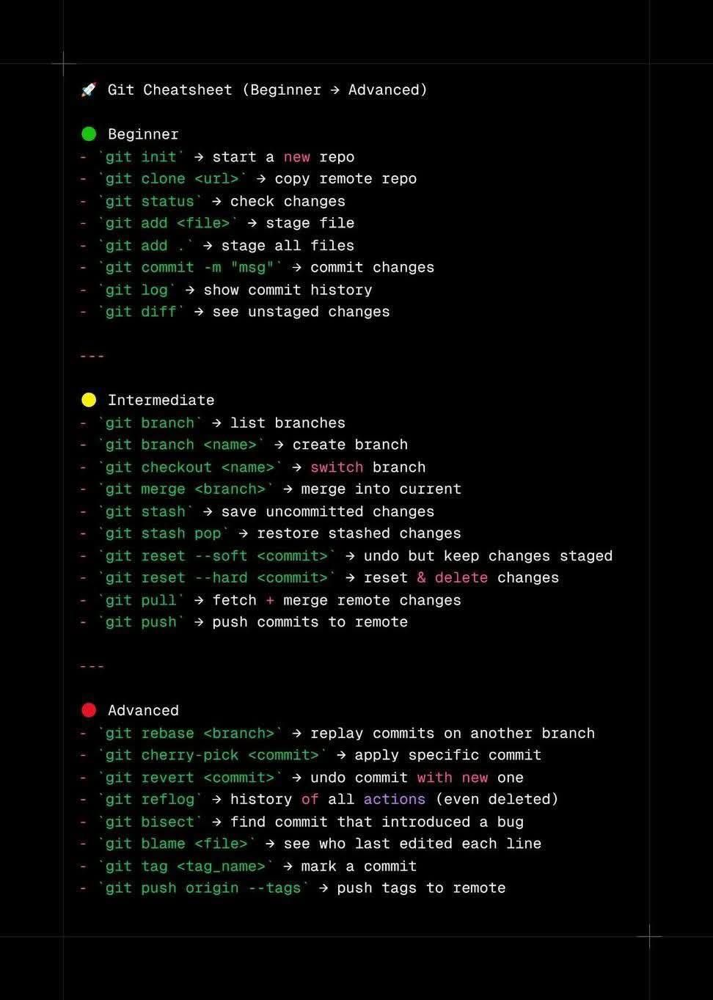

### 📄 Contents of `commands.txt`

#### Create a new project on your local machine, then push it your remote repo.

<pre>
$ git init
   Initialized empty Git repository in C:/Users/Amr AboRahma/.git/

$ git add .
    warning: LF will be replaced by CRLF in 7.0+CSS+Cascade/index.html.
    The file will have its original line endings in your working directory
    warning: LF will be replaced by CRLF in 7.0+CSS+Cascade/solution/solution.css.
    The file will have its original line endings in your working directory
    warning: LF will be replaced by CRLF in 7.0+CSS+Cascade/solution/solution.html.
    The file will have its original line endings in your working directory
    warning: LF will be replaced by CRLF in 7.0+CSS+Cascade/style.css.
    The file will have its original line endings in your working directory

$ git commit -m "1st commit"
[master (root-commit) 9080d86] 1st commit
 11 files changed, 396 insertions(+)
 create mode 100644 7.0+CSS+Cascade/goal.png
 create mode 100644 7.0+CSS+Cascade/index.html
 create mode 100644 7.0+CSS+Cascade/solution/solution.css
 create mode 100644 7.0+CSS+Cascade/solution/solution.html
 create mode 100644 7.0+CSS+Cascade/style.css
 create mode 100644 README.md
 create mode 100644 commands.txt
 create mode 100644 dev-file.txt
 create mode 100644 git-lab2.zip
 create mode 100644 images/git_cheatsheet.jpg
 create mode 100644 test-file.txt

$ git remote add origin git@https://github.com/22AhmedElkamash/isi-dashboard
$ git branch -M main
$ git push -u origin main
    Enumerating objects: 9, done.
    Counting objects: 100% (9/9), done.
    Delta compression using up to 16 threads
    Compressing objects: 100% (8/8), done.
    Writing objects: 100% (9/9), 842.46 KiB | 6.91 MiB/s, done.
    Total 9 (delta 1), reused 0 (delta 0), pack-reused 0
    remote: Resolving deltas: 100% (1/1), done.
    To github.com:m0ahmedd/git-task2-iti.git
    * [new branch]      main -> main
    branch 'main' set up to track 'origin/main'.
</pre>

#### Create two branches (dev & test) then create one file on each branch, and push this changes to the remote repo.

<pre>
$ git switch -c dev
Switched to a new branch 'dev'

$ git add .
$ git commit -m "dev 1st commit"
[dev b8c58dd] dev 1st commit
 1 file changed, 11 insertions(+), 11 deletions(-)

$ git push -u origin dev
   Enumerating objects: 5, done.
Counting objects: 100% (5/5), done.
Delta compression using up to 12 threads
Compressing objects: 100% (3/3), done.
Writing objects: 100% (3/3), 484 bytes | 484.00 KiB/s, done.
Total 3 (delta 2), reused 0 (delta 0), pack-reused 0
remote: Resolving deltas: 100% (2/2), completed with 2 local objects.
remote:
remote: Create a pull request for 'dev' on GitHub by visiting:
remote:      https://github.com/22AhmedElkamash/isi-dashboard/pull/new/dev
remote:
To github.com:22AhmedElkamash/isi-dashboard.git
 * [new branch]      dev -> dev
branch 'dev' set up to track 'origin/dev'.

$ git checkout -b test
    Switched to a new branch 'test'

$ git add .
$ git commit -m "test 1st commit"
    [test 4b23879] test 1st commit
    3 files changed, 28 insertions(+), 2 deletions(-)
    delete mode 100644 dev-file.txt
    create mode 100644 test-file.txt

$ git push -u origin test
Enumerating objects: 5, done.
Counting objects: 100% (5/5), done.
Delta compression using up to 12 threads
Compressing objects: 100% (3/3), done.
Writing objects: 100% (3/3), 512 bytes | 512.00 KiB/s, done.
Total 3 (delta 2), reused 0 (delta 0), pack-reused 0
remote: Resolving deltas: 100% (2/2), completed with 2 local objects.
remote:
remote: Create a pull request for 'test' on GitHub by visiting:
remote:      https://github.com/22AhmedElkamash/isi-dashboard/pull/new/test
remote:
To github.com:22AhmedElkamash/isi-dashboard.git
 * [new branch]      test -> test
branch 'test' set up to track 'origin/test'.
</pre>

#### Merge these changes on Main branch and then push it to your remote main branch.

<pre>
$ git checkout -b newBranch
    Switched to a new branch 'newBranch'

$ git add new-branch.txt
=> new-branch.txt file is created and added to stage

$ git stash         // stash saves your current stash, but u have to remember it to get it back using $git stash pop.
    Saved working directory and index state WIP on newBranch: 211a34a deleting the added file at main

$ git switch main
Switched to branch 'main'
Your branch is up to date with 'origin/main'.
</pre>

#### Create an annotated tag with tagname (v1.7)

<pre>
$ git add .
$ git commit -m "3rd commit"
    [main f136237] 3rd commit
 1 file changed, 2 insertions(+), 3 deletions(-)

$ git tag -a v1.7 -m "version 1.7"
</pre>

#### Push it to the remote repository

<pre>
$ git push origin v1.7
   Enumerating objects: 6, done.
Counting objects: 100% (6/6), done.
Delta compression using up to 12 threads
Compressing objects: 100% (4/4), done.
Writing objects: 100% (4/4), 457 bytes | 457.00 KiB/s, done.
Total 4 (delta 2), reused 0 (delta 0), pack-reused 0
remote: Resolving deltas: 100% (2/2), completed with 2 local objects.
To github.com:22AhmedElkamash/isi-dashboard.git
 * [new tag]         v1.7 -> v1.7
</pre>

#### Tell me how to list tags.

<pre>
$ git tag
    v1.7
</pre>

#### Tell me how to delete tag locally and remotely.

<pre>
$ git tag -d v1.7
    Deleted tag 'v1.7' (was f8e07d2)

$ git push origin --delete v1.7
    To github.com:22AhmedElkamash/isi-dashboard.git
 - [deleted]         v1.7
</pre>

# git_cheatsheet

